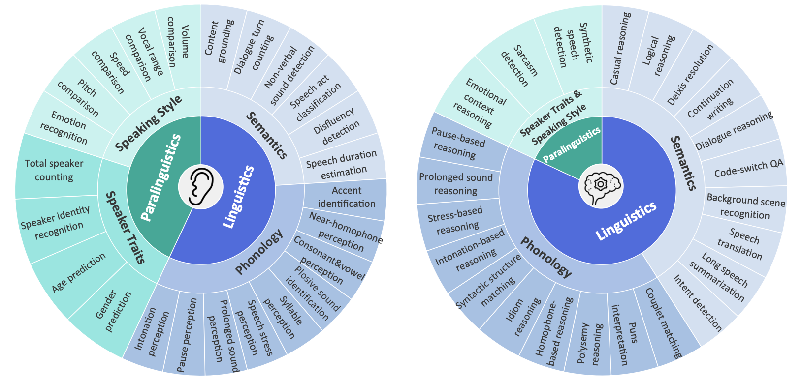

# MMSU: A Massive Multi-task Spoken Language Understanding and Reasoning Benchmark

[**📄 MMSU arXiv**](https://arxiv.org/pdf/2506.04779) | [**🎧 Demo Page**](https://ddw.github.io/mmsu_homepage/) | [**🏆 Leaderboard**](https://sakshi113.github.io/mmau_homepage/#leaderboard-v15-parsed) | [**🤗 Dataset Download**](https://huggingface.co/datasets/ddwang2000/MMSU) 

## 📌 Overview

MMSU (Massive Multi-task Spoken Language Understanding and Reasoning Benchmark) is a comprehensive benchmark for evaluating fine-grained spoken language understanding and reasoning in multimodal models. It systematically captures the variance of real-world linguistic phenomena in daily speech through 47 sub-tasks, including phonetics, prosody, rhetoric, syntactics, semantics, and paralinguistics, spanning both perceptual and higher-level reasoning capabilities. The benchmark comprises 5,000 carefully curated audio–question–answer pairs derived from diverse authentic recordings.

MMSU adopts a three-level taxonomy to organize tasks and assessment dimensions. **At the first level**, it distinguishes between perception and reasoning abilities. **At the second level**, both are divided into linguistics and paralinguistics.  Linguistics concerns language structure, meaning, and usage, whereas paralinguistics captures vocal characteristics that influence interpretation, such as emotion, pitch, and volume. **At the third level**, linguistics further branches into semantics and phonology, covering meaning and contextual understanding versus sound patterns such as tone and prosody.  Paralinguistics is divided into speaker traits, reflecting inherent vocal characteristics, and speaking style, capturing variable expressive elements.

## 🏆 Leaderboard
We evaluate multimodal models on MMSU benchmark across perception (Per.) and reasoning (Rea.) dimensions in Semantics, Phonology, and Paralinguistics domains.

| Models | Size | Avg (all) | Semantics (Per.) | Phonology (Per.) | Paralinguistics (Per.) | Avg (Per.) | Semantics (Rea.) | Phonology (Rea.) | Paralinguistics (Rea.) | Avg (Rea.) |
|---|---|---|---|---|---|---|---|---|---|---|
| 🏅Gemini-1.5-Pro | - | 60.68 | 57.06 | 53.60 | 31.23 | 46.10 | 79.47 | 83.46 | 46.33 | 76.16 |
| 🥈Qwen2.5-Omni-7B | 7B | 60.57 | 55.12 | 37.33 | 39.35 | 42.50 | 88.00 | 81.37 | 48.36 | 79.83 |
| 🥉Kimi-Audio | 7B | 59.28 | 57.64 | 42.30 | 35.74 | 43.52 | 81.77 | 76.65 | 55.22 | 76.03 |
| Qwen2.5-Omni-3B | 3B | 56.83 | 52.04 | 38.73 | 39.19 | 42.37 | 81.20 | 81.12 | 41.19 | 72.76 |
| MiniCPM-O | 8.6B | 56.53 | 56.56 | 34.05 | 36.48 | 40.54 | 80.71 | 74.72 | 46.71 | 73.57 |
| GPT-4o-Audio | - | 56.38 | 59.70 | 41.56 | 21.44 | 39.67 | 80.83 | 78.74 | 26.25 | 71.96 |
| MERaLiON | 10B | 54.10 | 54.49 | 33.69 | 25.84 | 35.74 | 80.32 | 77.18 | 41.49 | 73.68 |
| MERaLiON2 | 10B | 53.88 | 47.78 | 44.93 | 29.17 | 38.39 | 74.65 | 78.41 | 45.07 | 70.81 |
| Qwen2-Audio-Instruct | 8.4B | 53.27 | 52.14 | 32.87 | 35.56 | 39.02 | 77.62 | 64.81 | 46.67 | 68.90 |
| Gemini-2.0-Flash | - | 51.03 | 47.17 | 41.30 | 30.62 | 40.83 | 70.69 | 70.69 | 36.16 | 47.83 |
| Baichuan-Omni | 7B | 50.58 | 47.14 | 36.01 | 28.49 | 35.42 | 71.19 | 73.67 | 43.28 | 67.19 |
| Megrez-3B-Omni | 3B | 49.03 | 41.36 | 32.52 | 26.35 | 32.48 | 73.53 | 66.11 | 40.42 | 67.05 |
| DIVA | 8B | 48.31 | 44.36 | 33.72 | 27.45 | 33.95 | 62.32 | 74.24 | 40.00 | 65.04 |
| Qwen-Audio-Chat | 8.4B | 46.92 | 57.21 | 38.52 | 24.70 | 35.69 | 58.61 | 59.78 | 25.60 | 55.93 |
| Phi-4-Multimodal | 6B | 44.96 | 38.72 | 34.86 | 29.56 | 33.41 | 57.81 | 65.94 | 42.09 | 57.59 |
| Baichuan-Audio | 7B | 43.09 | 39.63 | 31.26 | 27.09 | 31.48 | 57.96 | 63.92 | 34.35 | 55.70 |
| GLM-4-Voice | 9B | 35.51 | 27.80 | 24.52 | 27.34 | 26.18 | 46.10 | 48.16 | 44.35 | 46.76 |
| BLSP | 7B | 35.96 | 31.35 | 20.96 | 23.75 | 28.36 | 47.91 | 42.31 | 42.08 | 44.97 |
| Lyra | 7B | 16.11 | 17.31 | 9.47 | 18.59 | 15.78 | 10.36 | 25.71 | 23.42 | 16.42 |

## 📊 Evaluation Pipeline

 

